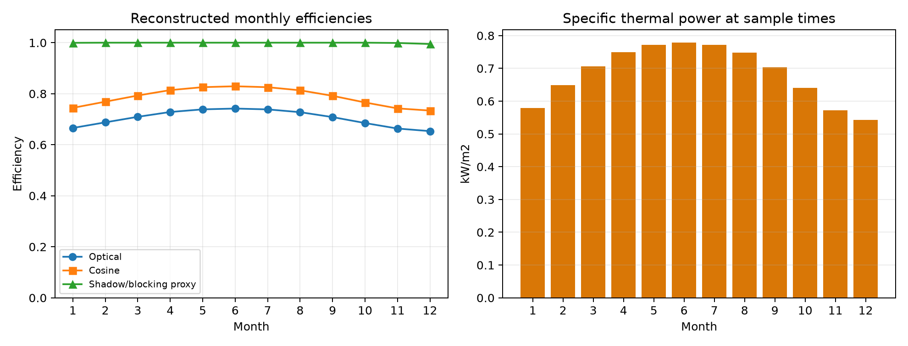
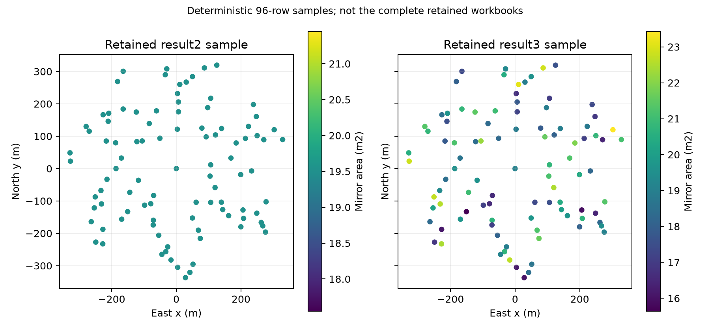
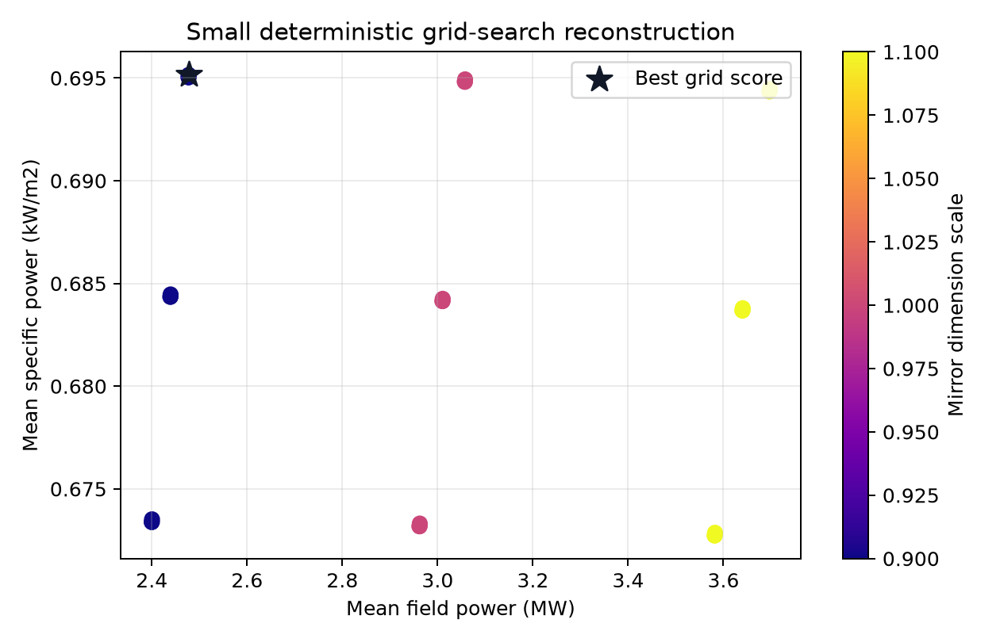

# 定日镜场光学效率与布局优化重构

[English](README.en.md) | [模型假设](docs/model-assumptions.md) | [数据来源](docs/data-provenance.md) | [论文对照](docs/paper-comparison.md)

这是对 2023 年全国大学生数学建模竞赛 A 题“定日镜场的优化设计”的**证据边界重构**。项目依据参赛论文《基于多目标规划模型的定日镜参数研究》和留存的 `result2.xlsx`、`result3.xlsx` 重新实现；它**不是比赛时的原始代码，也不声称严格复现论文数值**。

## 项目能做什么

- 计算太阳赤纬、时角、太阳向量与法向直接辐照度（DNI）；
- 由太阳方向和接收器方向计算定日镜法向量；
- 计算余弦效率、大气透射率；
- 使用明确标注的近邻解析代理计算阴影/遮挡效率；
- 使用高斯光斑圆孔近似计算集热器截断效率；
- 汇总 12 个月、每天 5 个时刻的光学效率与输出热功率；
- 对留存的 `result2/result3` 派生小样本进行布局和尺寸对比；
- 运行一个固定种子、确定性的小规模网格优化示例。

## 快速开始

```bash
python -m venv .venv
# Windows
.venv\Scripts\python -m pip install -e ".[dev]"
.venv\Scripts\python -m pytest
.venv\Scripts\python -m heliostat_field --output-dir artifacts/demo
```

测试命令：`python -m pytest`
演示命令：`python -m heliostat_field --output-dir artifacts/demo`

演示不依赖留存 Excel 原件；默认使用公开可生成的环形合成布局。仓库中的图表由同一命令真实生成。

## 已生成结果







这些结果只证明当前 Python 重构可以运行。阴影/遮挡和截断模型是可解释近似，不等同于逐镜多边形光线追迹。完整差异见 [论文对照](docs/paper-comparison.md)。

## 数据边界

- 原始 PDF、Word、证书、RAR 和 Excel 均未加入仓库；
- 两个完整工作簿属于团队留存结果，公开再分发授权不明确，因此只发布 96 行确定性小样本和聚合统计；
- 不发布官方赛题附件、完整参赛论文或未脱敏证书；
- 数据样本保留原值，没有为了贴合论文而修改；
- 完整工作簿审计发现约束异常，详见 [数据来源](docs/data-provenance.md)。

## 奖项说明

留存证书支持以下文字陈述：2023 年全国大学生数学建模竞赛广东省赛区本科组二等奖，参赛题目为 A 题“定日镜场的优化设计”。证书原件包含个人信息和二维码，未上传。本仓库展示的是赛后重构能力，不扩大个人贡献范围。

## 仓库结构

```text
src/heliostat_field/   核心太阳位置、光学、仿真与优化代码
tests/                 自动化测试
data/derived/          小型派生样本、聚合统计和派生清单
scripts/               从私有留存 Excel 生成公开派生数据的脚本
figures/               真实运行生成的图表和 JSON/CSV 摘要
docs/                  模型、数据、架构、验证和论文差异说明
```

## 限制

- 未找到独立的竞赛 MATLAB/Python 工程；论文附录虽有代码片段，但包含不可行收敛日志和不完整变量定义；
- 当前阴影/遮挡模型不是精确几何投影；
- 当前截断效率不是 Monte Carlo 光线追迹；
- 没有验证论文中的 60 MW 可行性或其报告的功率数值；
- 没有真实电站、硬件或现场测量验证。

## 许可与贡献

重构代码使用 [MIT License](LICENSE)。派生数据的来源与限制单独写在 `data/README.md`，不因代码许可而改变。欢迎先阅读 [CONTRIBUTING.md](CONTRIBUTING.md) 和 [SECURITY.md](SECURITY.md)。
